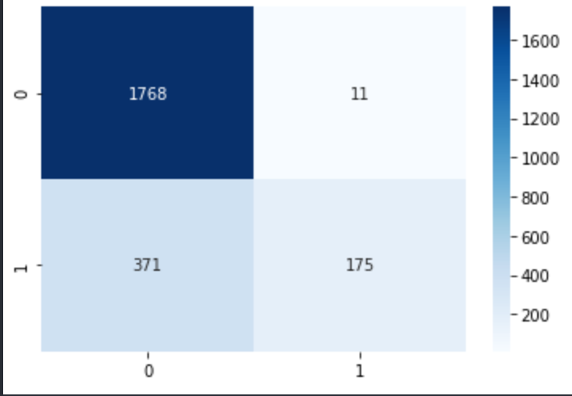
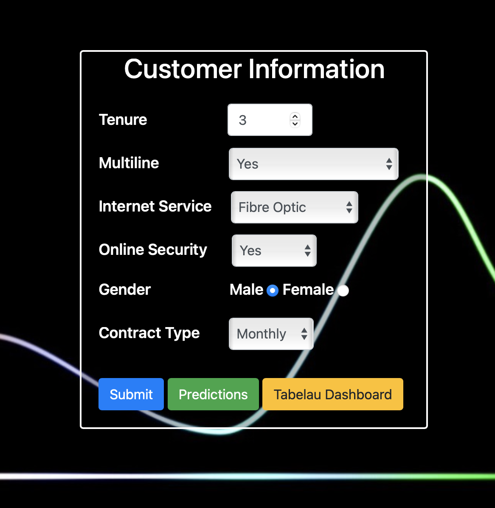

# CUSTOMER CHURN

## INTRODUCTION

The dataset comes from IBM and is called Telco Customer Churn and can be downloaded by following this [link](https://community.ibm.com/community/user/businessanalytics/blogs/steven-macko/2019/07/11/telco-customer-churn-1113). Churn in simple terms means leaving the company. It is very critical for a business to have an idea about why and when customers are likely to churn. Having a robust and accurate churn prediction model helps businesses to take actions to prevent customers from leaving the company.

## AIM

The aim of the project was to predict the churn based on several factors such as Contract type, Internet Plans, Internet Plan Add-ons etc. Finally, once the model is created deploy the model on the cloud.

## CLEANING & WRANGLING

1. Identified and fixed duplicated values for example. DSL and dsl in InternetService meant the same thing even though they were separate.

2. Converted datatype to appropriate form such as category and float from object.

3. One-hot encoded the values that had no order and manually Label Encoded the values that had order.

## MODELING

1. I have compared six algorithms  KNeighborsClassifier, SVC, DecisionTreeClassifier, RandomForestClassifier, MLPClassifier, GaussianNB and based on the accuracy selected the model. 

2. Models such as DecisionTreeClassifier, MLPClassifier unfortunately suffered from over-fitting issue and were not selected.

3. RandomForestClassifier was preferred based on the accuracy which was 82%. 

In-depth details about the cleaning, wrangling and modeling tasks can be found the [Cleaning_Wrangling_Modeling](Cleaning_Wrangling_Modeling.ipynb) notebook. Below is the confusion matrix for RandomForest Classifier.

## WEB APP

1. The dataset had close to 20 variables, therefore, I have created a small subset of data for the web-app. The subset contains only 6 variables which include Tenure, Multiline Account details, Internet Service Details, Online Security Details, Gender and Contract Type. I have followed the same steps in the [Cleaning_Wrangling_Modeling](Cleaning_Wrangling_Modeling.ipynb) notebook to create the model required for the app.

2. The app uses flask web-framework and the model along with the app is deployed on Heroku cloud. The app can be accessed by following this https://churn-customer.herokuapp.com/ . Below is the screenshot of the app.

